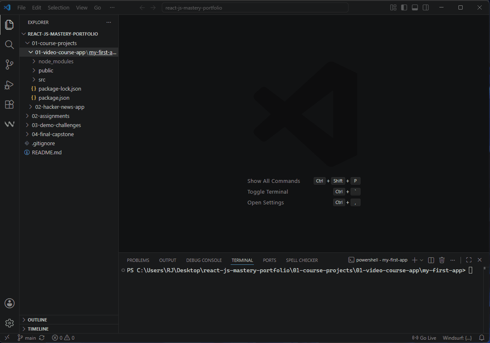
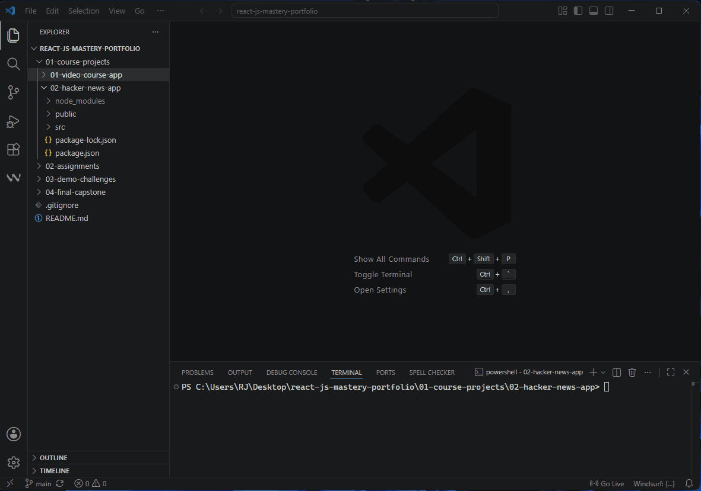
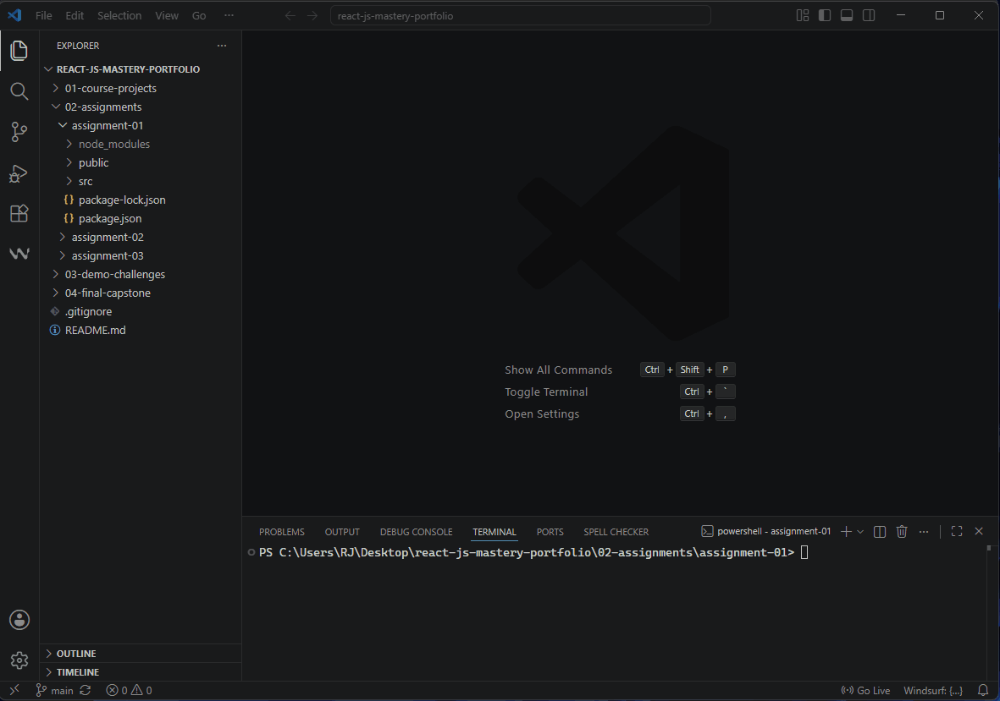

# React.js Advanced Architecture & Applications Portfolio

Welcome to my central React.js development track repository. This comprehensive portfolio documents my structural learning journey, evolutionary practices, and architectural milestones in building scalable user interfaces during the Matrix Master Full-Stack Web Development Bootcamp.

This track showcases my transition from traditional state management to advanced server-side data operations, custom component engineering, and functional data flows.

---

## 📂 Repository Architecture & Track Milestones

The repository is structured to separate exploration projects, formal assignments, and advanced technical challenges systematically:

### 📁 01. Course Projects & Learning Experiments
Incremental applications built chronologically to master component states, lifecycles, and HTTP network clients.
* **`01-video-course-app` (User Directory Client):** * Demonstrates core knowledge of lifecycle execution via `componentDidMount`.
    * Utilizes the **Axios** library to asynchronously fetch live user records (names, emails) from the RESTful `JSONPlaceholder` API.
    * Implements basic component abstraction using dynamic title props.
    
    <details>
    <summary>🎬 <b>Click to View Project Demo Execution</b></summary>
    <br>
    
    </details>

* **`02-hacker-news-app` (Live Tech News Search Engine):**
    * An advanced implementation showcasing **Server-side Search functionality** using the Hacker News API.
    * Enforces strict immutability patterns using the **ES6 Spread Operator (`...`)** to alter complex nested state results without direct mutation.
    * Implements **Conditional Rendering (Ternary Operations)** to elegantly swap layouts during active API loading states.
    * Enforces runtime interface safety and data contract validity across abstract modules using **`prop-types` validation**.
    
    <details>
    <summary>🎬 <b>Click to View Project Demo Execution</b></summary>
    <br>
    
    </details>

### 📁 02. Assignments
Rigorous practical implementations built against strict business criteria and real-world user stories.
* **`assignment-01` (Custom Styled ToDo App):**
    * A responsive task management tracker handling state synchronization across multiple controlled input streams (`taskInput` and `descriptionInput`).
    * Features transactional list rendering, structural safety checks (required fields), and state-level array filtering routines on dismiss.
    * Features a custom-engineered CSS presentation layer to implement fluid UX hover behaviors and structured card layers.
    
    <details>
    <summary>🎬 <b>Click to View Project Demo Execution</b></summary>
    <br>
    
    </details>

* *`assignment-02` & `assignment-03` (Pending Progression)*

### 📁 03. Demo Challenges
Targeted algorithmic layouts and quick architectural challenges designed to strengthen UI composition.
* *`demo-challenge-01`, `02`, & `03` (Pending Progression)*

### 📁 04. Final Capstone
* **`main-react-challenge` (Final Course Capstone - Pending)*

---

## 🛠️ Core Engineering Skills Demonstrated

Throughout this track, the following computer science and software engineering principles are strictly maintained:
1.  **Immutability & Pure Functions:** Complete avoidance of state transformation mutations.
2.  **Type Safety:** Component defensive programming via strict explicit `propTypes` checking.
3.  **UI/UX Intent:** Designing fluid feedback indicators (loaders, empty states, and focus states) to guarantee pristine user journeys.
4.  **Component Modularization:** Decoupling bloated structures into specialized Single-Responsibility components.

---

## 🚀 Local Installation & Execution

To explore or run any specific app or assignment locally, ensure you have [Node.js](https://nodejs.org/) installed, then execute:

```bash
# Clone the repository
git clone https://github.com/rajyabdullah-spec/react-js-mastery-portfolio.git
# Navigate into the specific directory, for example:
cd react-js-mastery-portfolio/02-assignments/assignment-01

# Install architectural dependencies
npm install

# Initialize local Webpack development server
npm start
```
---

## 👨‍💻 Designed & Developed By

* **Developer:** Raji Al-Abdullah
* **Track:** Full-Stack Web Development (React.js Architecture)
* **Portfolio Hub:** [Visit My Live Portfolio Hub](https://rajyabdullah-spec.github.io/matrix-master-exercises/portfolio-hub/) 🌐