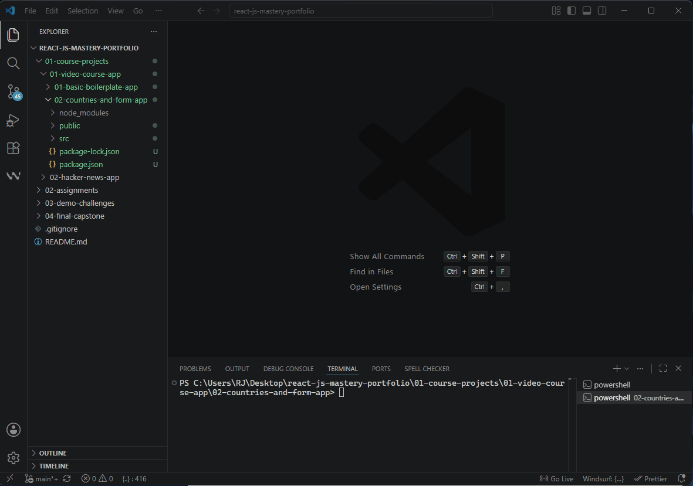
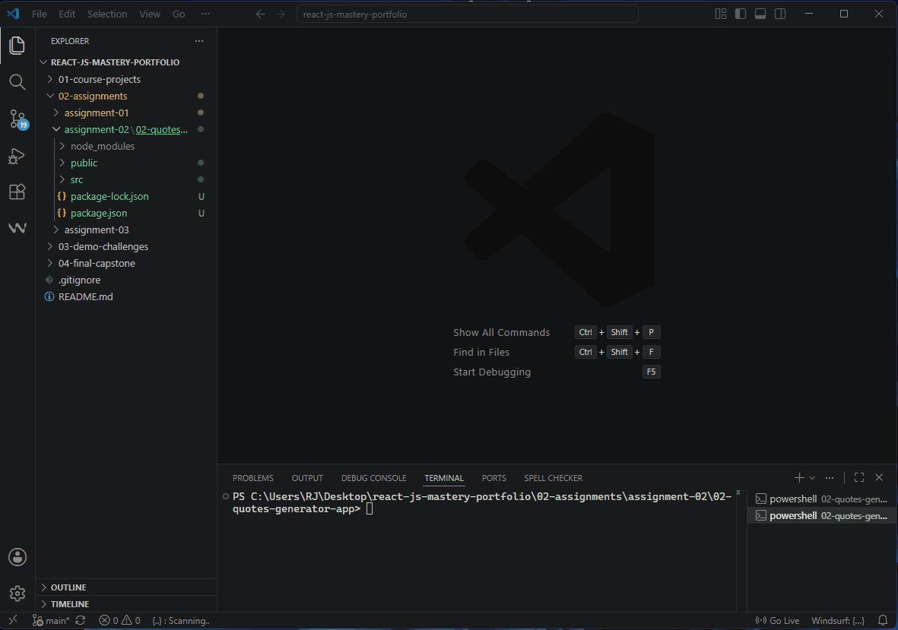

# React.js Advanced Architecture & Applications Portfolio

Welcome to my central React.js development track repository. This comprehensive portfolio documents my structural learning journey, evolutionary practices, and architectural milestones in building scalable user interfaces during the Matrix Master Full-Stack Web Development Bootcamp.

This track showcases my transition from traditional configuration management to advanced server-side data operations, custom component engineering, and functional data flows.

---

## 📂 Repository Architecture & Track Milestones

The repository is structured to separate exploration projects, formal assignments, and advanced technical challenges systematically:

### 📁 01. Course Projects & Learning Experiments
Incremental applications built chronologically to master component states, lifecycles, Hooks, and HTTP network clients.

* **`01-basic-boilerplate-app` (Core Layout Framework):**
    * Demonstrates core knowledge of structural React architecture and foundational component initialization.
    * Implements isolated component abstraction using clean, separated CSS layout strategies to optimize presentation layers.
    
    <details>
    <summary>🎬 <b>Click to View Project Demo Execution</b></summary>
    <br>
    
    </details>

* **`02-countries-and-form-app` (World Countries & User Setup Hub):**
    * A high-fidelity application mastering functional hooks (`useState` and `useEffect`) and asynchronous network operations.
    * Utilizes the **Axios** library to fetch live global data and dynamic flags from an external RESTful API without CORS conflicts.
    * Integrates interactive state behaviors, showing detailed data cards and external reference anchors instantly when a country is selected.
    * Implements a **Controlled Form** layout for user credentials (username and email address) with an instantaneous interactive Live Preview box.
    * Features an optimized presentation layer utilizing an isolated vertical scrollable container (`max-height` and `overflow-y`) for improved UI/UX data scanning.
    
    <details>
    <summary>🎬 <b>Click to View Project Demo Execution</b></summary>
    <br>
    
    </details>

* **`03-hacker-news-app` (Live Tech News Search Engine - Next Milestone):**
    * An advanced implementation showcasing **Server-side Search functionality** using the Hacker News API.
    * Enforces strict immutability patterns using the **ES6 Spread Operator (`...`)** to alter complex nested state results without direct mutation.
    * Implements **Conditional Rendering (Ternary Operations)** to elegantly swap layouts during active API loading states.
    * Enforces runtime interface safety and data contract validity across abstract modules using **`prop-types` validation**.
    
    <details>
    <summary>🎬 <b>Click to View Project Demo Execution</b></summary>
    <br>
    
    </details>

### 📁 02. Assignments
Rigorous practical implementations built against strict business criteria and real-world user stories.
* **`assignment-01` (Custom Styled ToDo App):**
    * A responsive task management tracker handling state synchronization across multiple controlled input streams (`taskInput` and `descriptionInput`).
    * Features transactional list rendering, structural safety checks (required fields), and state-level array filtering routines on dismiss.
    * Features a custom-engineered CSS presentation layer to implement fluid UX hover behaviors and structured card layers.
    
    <details>
    <summary>🎬 <b>Click to View Project Demo Execution</b></summary>
    <br>
    
    </details>

* **`assignment-02` (Inspirational Quotes Generator):**
    * An asynchronous dynamic application driven by functional state management (`useState`, `useEffect`) and Axios network integration.
    * Features robust async state handling (loading/error state boundaries) to optimize client-side performance and prevent concurrent API request flooding.
    * Enforces pristine code safety by using React-compliant properties (`className` and explicit JSX `onClick` callback streams).
    * Implements an isolated CSS layout architecture featuring a modern dark presentation header, professional typography weights (`Playfair Display`), and responsive card containers.

    <details>
    <summary>🎬 <b>Click to View Project Demo Execution</b></summary>
    <br>
    
    </details>

* **`assignment-03` (The Timeline Engine):**
    * A high-fidelity single-page engine managing nested relational data models through advanced client-side state handling.
    * Implements an architecture utilizing the **React Context API** for globally accessible data tracking, managing one-to-many relationships between timeline entries and comments.
    * Enforces precise bidirectional chronologic data streams: main entries are structurally ordered by recent timestamps, while sub-level community feedback flows sequentially from oldest to newest.
    * Features an enterprise-grade Premium Dark/Soft UI presentation layer built with micro-interactions, responsive form focus parameters, and optimized layout boundaries.

    <details>
    <summary>🎬 <b>Click to View Project Demo Execution</b></summary>
    <br>
    
    </details>

### 📁 03. Demo Challenges
Targeted algorithmic layouts and quick architectural challenges designed to strengthen UI composition.
* **`demo-challenge-01` (Premium Music Engine):**
    * Asynchronous application capturing complex metadata query strings, interacting with the real-time **Apple iTunes Search API Engine**.
    * Features structural dynamic data list mapping accompanied by rich responsive media covers and precise execution logic parameters.
    * Enforces controlled form state submission behaviors to orchestrate clean client-side filter lifecycles.
    
    <details>
    <summary>🎬 <b>Click to View Project Demo Execution</b></summary>
    <br>
    
    </details>

* *`demo-challenge-02` & `03` (Pending Progression)*

### 📁 04. Final Capstone
* **`main-react-challenge` (Final Course Capstone - Pending)*

---

## 🛠️ Core Engineering Skills Demonstrated

Throughout this track, the following computer science and software engineering principles are strictly maintained:
1.  **Immutability & Pure Functions:** Complete avoidance of state transformation mutations.
2.  **Type Safety & Controlled Data:** Handling stateful data input streams strictly through React's state management lifecycle to ensure a single source of truth.
3.  **UI/UX Intent:** Designing fluid feedback indicators (loaders, responsive scrolling areas, and focus states) to guarantee pristine user journeys.
4.  **Component Modularization:** Decoupling bloated structures into specialized Single-Responsibility components within clear directory trees.

---

## 🚀 Local Installation & Execution

To explore or run any specific app or assignment locally, ensure you have [Node.js](https://nodejs.org/) installed, then execute:

```bash
# Clone the repository
git clone https://github.com/rajyabdullah-spec/react-js-mastery-portfolio.git
# Navigate into the specific directory, for example:
cd react-js-mastery-portfolio/02-assignments/assignment-01

# Install architectural dependencies
npm install

# Initialize local Webpack development server
npm start
```
---

## 👨‍💻 Designed & Developed By

* **Developer:** Raji Al-Abdullah
* **Track:** Full-Stack Web Development (React.js Architecture)
* **Portfolio Hub:** [Visit My Live Portfolio Hub](https://rajyabdullah-spec.github.io/matrix-master-exercises/portfolio-hub/) 🌐